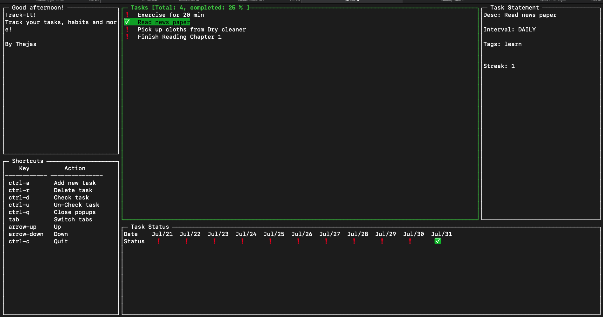

# Track-it

A habit tracking application

## Requirements

1. Golang
2. Make


## Setup

1. Run make build to generate the executable `track-it`

2. Run the executable `./track-it`

3. One can also run with a subreddit flag, which allows it to pull top posts from the subreddit. For eg, to return the top posts from the subreddit `r/quotes`, run it as

```
./track-it -subreddit=quotes
```

## Functionality

1. Add a task of type
    - NONE (N) For one time task
    - DAILY (D) For daily task
    - WEEKLY (W) For weekly task
    - MONTHLY (M) For monthly task

1. Delete a task

1. Track the task for the interval specified

1. List all the task required to be done

## Screenshot



## Note

There are still some minor bugs in the application, please raise them as issues.